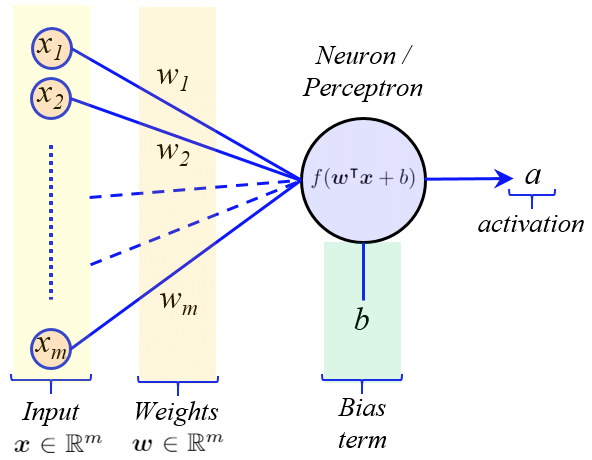
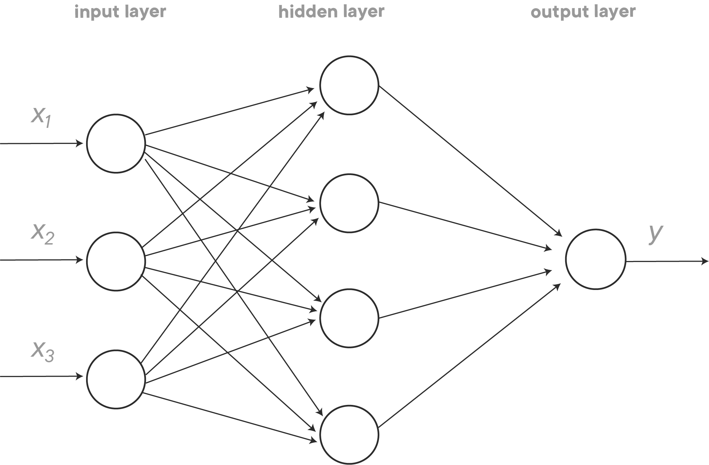
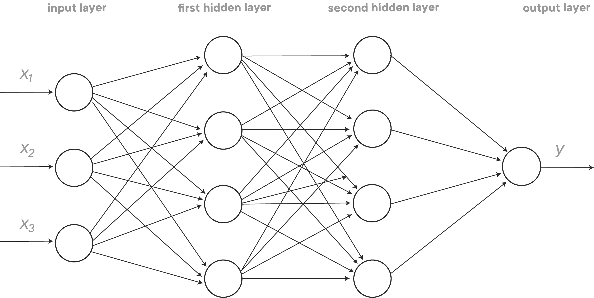
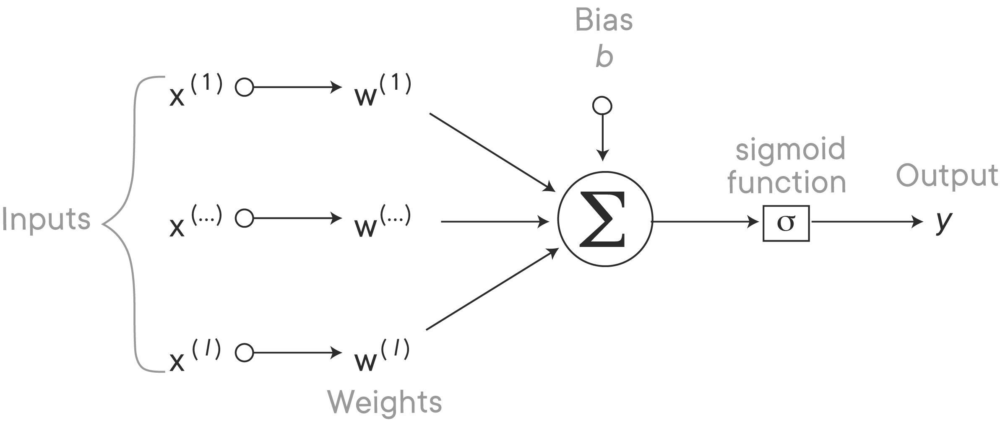
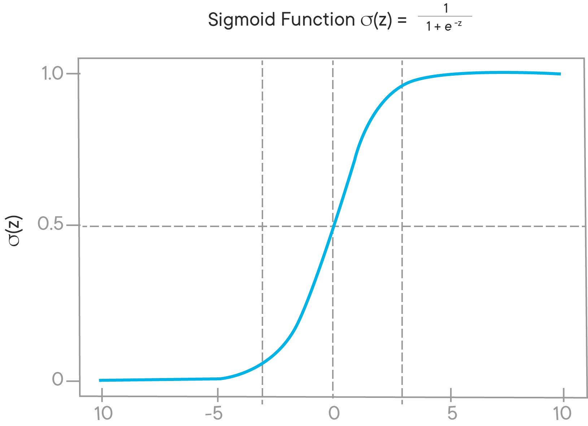
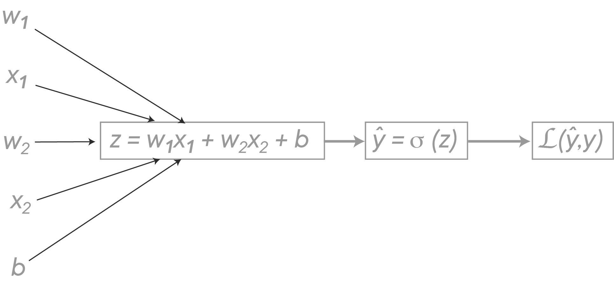

# Introduction to Artificial Neural Networks

## Objectives

- Explain what **neural networks** are and what they can achieve
- List the components of a neural network
- Explain **forward propagation**
- Explain **backward propagation** and discuss how it is related to forward propagation

## Basic Unit of Computation in an Artificial Neural Network

The basic unit of computation in a neural network is the **neuron/perceptron**, often called a **node**. It receives an array of inputs ($\textbf{\textit{x}}$) and computes an output ($a$). Each input has an associated **weight** ($w$), which is assigned based on its relative importance to other inputs. The node sums the weighted inputs with some **bias** ($b$), and then applies an **activation function** $f$ to this quantity, that is:

$$ a = f(\textbf{\textit{w}}^T\textbf{\textit{x}}+b) $$

The activation function is necessary to convert the unbounded input $(\textbf{\textit{w}}^T\textbf{\textit{x}}+b)$ into an output that is bounded within some interval (usually $[0,1]$ or $[-1,1]$). Introducing a bias allows the activation function to be shifted to the left or right, which can be critical for successful learning.

*A generic neuron/perceptron is illustrated below:*

 

## Definition & Architecture of Artificial Neural Networks

> An **Artificial Neuron Network (ANN)**, is a computational model that arises when multiple neurons/perceptrons are connected together.

There are 3 different layers in a neural network :
- **Input Layer** - layer in which inputs are fed to the model
- **Hidden Layer(s)** - layer(s) in which inputs are processed
- **Output Layer** - layer from which the output of the model is extracted

*An example architecture of an Artificial Neural Network with a single hidden layer is shown below:*

The design of the input and output layers is often straightforward. **For example, suppose we are trying to determine whether or not a handwritten image depicts a single-digit number ($1$-$9$):**
- For the *input layer*, it would be most natural to encode the intensities of each image pixel as an array of inputs. Suppose the input is a $64 \times 64$ greyscale image, then we would have $64 \times 64=4,096$ corresponding input neurons.
- The *output layer* must contain $10$ neurons, each of these neurons corresponding to a potential output label of $1$-$9$. For the neutron whose output corresponds to whether or not a handwritten digit is a $7$:
    -  $y < 0.5 \implies$ input image **is not** a $7$
    -  $y > 0.5 \implies$ input image **is** a $7$

## Main Advantages of Artificial Neural Networks

#### Extensibility

The architecture of a neural network can be extended almost endlessly:

- the *input layer* can be extended to account for a wider variety features (by introducing more input nodes)
- the *hidden layers* can be extended by:
    - adding the number of nodes in a hidden layer
    - increasing the number of hidden layers in the network
- the *output layer* can be extended to predict a greater number of possible outcomes (by introducing more output nodes)

*An example architecture of an Artificial Neural Network with two hidden layers (as an extension of the previous diagram) is shown below:*

#### Flexibility

If a dataset is organized such that each row corresponds to a single observation and each column corresponds to a single feature, then it contains **structured data**. On the other hand there is **unstructured data**, which takes the form of images, audio files, textual data, and much more. Unlike most other statistical and machine learning techniques, neural networks can easily handle **unstructured data**.

## Logistic Regression as a Neural Network

#### Formulating the Neural Network

In order to build a neural network that can perform logistic regression, only **a single neuron** is needed, and it is essentially an output node. It takes inputs that we *already know*, and it directly computes the observed output using a sigmoid activation function, with no hidden layers in between. This is referred to as a **sigmoid neuron**. Since this sigmoid neuron is essentially an output layer, it is considered a **1-layer network**.

Remember that, for logistic regression models, the predicted outcome is bounded between $0$ and $1$, that is, $\hat{y} \in [0,1]$:

$$ \hat y = P(y=1 \mid x), \ \  \  x \in \mathbb{R}^n $$

*A diagram illustrating how a sigmoid neuron performs logistic regression is shown below:*

From the diagram above, we can see that the neuron performs the following computation:

$$ \hat y = \sigma(z) = \sigma(w^T x + b), \ \ \ w \in \mathbb{R}^n, \ b \in \mathbb{R}^n $$

As mentioned previously, the activation function $f$ is the sigmoid function ($\sigma$):

$$ \sigma(z) = \frac{1}{1 + e^{-z}} $$

The **sigmoid function** ($\sigma$) is a popular activation function in neural networks because, instead of a simple step function, most real-world applications require a smooth decision function that gradually changes from $0$ to $1$. Just like in logistic regression, the sigmoid function ensures the output is bounded in the range $[0,1]$.
*This is illustrated by the graph of the sigmoid function, which is shown in the plot below:*

#### Defining the Loss Function

> The **loss function [$\mathcal{L}(\hat y, y)$]** is used to measure the deviation of the predicted label (**$\hat y$**) from the true label (**$y$**) for a given training sample.

When performing binary classification, the loss function for a given training sample is defined as:

$$ \mathcal{L}(\hat y, y) = - ( y \log (\hat y) + (1-y) \log(1-\hat y)) $$

The loss function defined above has the advantage of being convex, which makes optimization by gradient descent easier.

#### Defining the Cost Function

> The **cost function [$J(w, b)$]** is simply the average loss over all training samples:
> **$$ J(w,b) = \frac{1}{m}\sum^m_{i=1}\mathcal{L}(\hat y^{(i)}, y^{(i)}) $$**

Reemember that, when training a logistic regression model, the purpose is to find parameters $w$ and $b$ such that the cost function $J(w,b)$ is minimized.

#### Performing Gradient Descent

##### Forward Pass

**Forward propagation** (or forward pass) refers to the calculation and storage of intermediate variables, from which the outputs are calculated in a neural network. Forward propogation starts from the input layer and terminates at the output layer, and computes $\hat{y}$, which in turn allows us to compute the loss function, $\mathcal{L}(\hat y , y)$.

> **Assume that our logistic regression perceptron accepts two features, $x_1$ and $x_2$, whose weights are $w_1$ and $w_2$ respectively.**

*The computational graph below describes forward propogation in a logistic regression perceptron:*

##### Backwards Pass

**Backpropagation** refers to the method of calculating the gradient of neural network parameters. In short, the method traverses the network in reverse order, from the output to the input layer, according to the chain rule from calculus. Backpropogation allows us to calculate the gradient of the cost function with respect to the model parameters ($\frac{\partial J}{\partial w}$ and $\frac{\partial J}{\partial b}$), through which we can find optimal values of $w$ and $b$. Therefore, the training of a neural network is achieved via backpropagation.

After each each forward propogation, the model parameters are updated using the gradient of the cost function and some learning rate ($\alpha$):

$$ w := w - \alpha \frac{\partial J(w,b)}{\partial w} $$
$$ b := b - \alpha \frac{\partial J(w,b)}{\partial b} $$

##### Backpropogation with a Single Training Sample

With respect to the above 1-layer network, the steps outlining backpropogation *for a single training sample* are as follows:

> 1) Compute the **derivative of $\mathcal{L}(\hat y , y)$ with respect to $\hat y$**:
> **$$  d \hat y \equiv \frac{\partial \mathcal{L}}{\partial \hat y}  =  \frac{-y}{\hat y}+ \frac{1-y}{1-\hat y} $$**

> 2) Compute the **derivative of $\mathcal{L}(\hat y , y)$ with respect to $z$**:
> **$$ dz \equiv \frac{\partial \mathcal{L}}{\partial z} = \frac{\partial \mathcal{L}}{\partial \hat y}  \frac{d\hat y}{dz} = d\hat y * \sigma^{\prime}(z)   =  \hat y - y$$**

> 3) Compute the **derivative of $\mathcal{L}(\hat y , y)$ with respect to $w_1$, $w_2$ and $b$**:
> **$$ dw_1 \equiv \frac{\partial \mathcal{L}}{\partial w_1} = \frac{\partial \mathcal{L}}{\partial z}\frac{\partial z}{\partial w_1} = x_1 dz $$**
>
> **$$ dw_2 \equiv \frac{\partial \mathcal{L}}{\partial w_2} = \frac{\partial \mathcal{L}}{\partial z}\frac{\partial z}{\partial w_2} = x_2 dz $$**
>
> **$$ db \equiv \frac{\partial \mathcal{L}}{\partial b} = \frac{\partial \mathcal{L}}{\partial z} \frac{\partial z}{\partial b} = dz $$**

> 4) Update the model parameters:
> **$$ w_1 := w_1 - \alpha dw_1 $$**
>
> **$$ w_2 := w_2 - \alpha dw_2 $$**
>
> **$$ b := b - \alpha db $$**

##### Gradient Descent on $m$ Training Samples

The cost function is the average loss over all $m$ training samples:

$$ J(w,b) = \frac{1}{m}\sum^m_{i=1}\mathcal{L}(\hat y^{(i)}, y^{(i)}) $$

For the $i^{\text{th}}$ training sample, forward propogation computes:

$$ \hat y^{(i)} = \sigma (z^{(i)}) = \sigma (w^T x^{(i)} + b) = \sigma (w_1 x_1^{(i)} + w_2 x_2^{(i)} + b) $$

The derivative of the overall cost function with respect to $w$ is the average of the derivatives of each loss term with respect to $w$:

> **$$ dw \equiv \frac{\partial J}{\partial w} = \frac{1}{m}\sum^m_{i=1} \frac{\partial \mathcal{L}(\hat y^{(i)}, y^{(i)})}{\partial w} = \frac{1}{m}\sum^m_{i=1} (dw^{(i)}) $$**

Similarly, the derivative of the overall cost function with respect to $b$ is the average of the derivatives of each loss term with respect to $b$:

> **$$  db \equiv \frac{\partial J}{\partial b} =  \frac{1}{m}\sum^m_{i=1} \frac{\partial \mathcal{L}(\hat y^{(i)}, y^{(i)})}{db} = \frac{1}{m}\sum^m_{i=1} (db^{(i)}) $$**

Given the above information, we can implement gradient descent to minimize the cost function of our sigmoid neuron with the following algorithm:

> **$ J = 0; \ \ \ 1 = 0; \ \ \ 2 = 0; \ \ \ = 0 $**
>
> **$ \text{for} \  i \ \text{in} \ \text{range}(m): $**
>
>> **$ \hat y^{(i)} = \sigma (z^{(i)}) = \sigma (w_1 x_1^{(i)} + w_2 x_2^{(i)} + b) $**
>>
>> **$ J := J + \{- [y^{(i)} \log (\hat y^{(i)}) + (1-y^{(i)}) \log(1-\hat y^{(i)})]\}$**
>>
>> **$ dz^{(i)} = \hat y^{(i)}- y^{(i)} $**
>>
>> **$ dw_{1} := dw_{1} + x_1^{(i)} dz^{(i)} $**
>>
>> **$ dw_{2} := dw_{2} + x_2^{(i)} dz^{(i)} $**
>>
>> **$ db := db + dz^{(i)} $**
>
>
> **$ dw_{1} := \dfrac{dw_{1}}{m}; \ \ \ dw_{2} := \dfrac{dw_{2}}{m}; \ \ \ db := \dfrac{db}{m} $**
>
> **$ w_1 := w_1 - \alpha dw_1 $**
>
> **$ w_2 := w_2 - \alpha dw_2 $**
>
> **$ b := b - \alpha db $**
